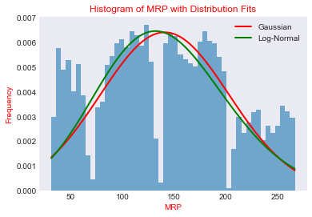

# Bigmartsales_extensive_eda_pipeline
Extensive EDA, Preprocessing and model Building on Big Mart Sales Dataset

In this project, I have performed extensive analysis on BigMart Sales dataset of 1559 products collected by data scientists across 10 stores in different cities and .

## Analysis and Visualizations
### Pie Charts
.png)

### Bar Plot
.png)
.png)
.png)
### Histograms
 
.png)
.png)

### Box Plots

.png)

### Scatter Plots

.png)
### Time-based Analysis

.png)

# Line plots
.png)
.png)
.png)

## Preprocessing and model deployment
for preprocessing the data I have various methods like standardscaling, Onehot Encoding etc. For cleaning the data I tried to retain as much information as I can. So, I used to group the data of the column containing the missing value with respect to the other colums and then depending on the type of the data I either just replicated the data for same group or used mean, median, mode  as well. For deployment I created a pipeline for preprocessing and model(Decision trees) for training the data and predicting the output for the test data
 
